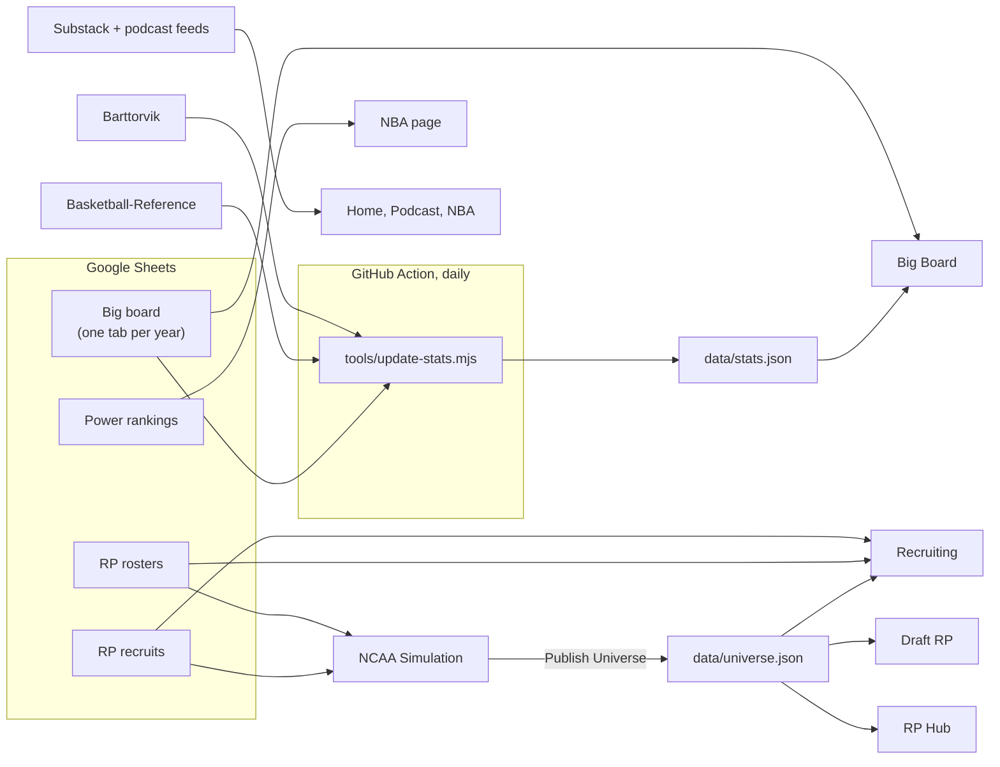

# BYTHERIM


**[bytherim.com](https://bytherim.com)** — unbiased basketball coverage: an NBA draft big board, film breakdowns, the podcast, and **BYTHERIM RP**, a full college basketball universe with its own recruiting, season simulation and NBA draft.

The whole site is plain HTML, CSS and JavaScript served by GitHub Pages. There's no build step and no server: content comes from Google Sheets and public feeds, and two small data files in `data/` tie everything together.

## The site

| Page | What it is |
|---|---|
| [Home](https://bytherim.com/) | Latest writing and episodes, the big board top 10, YouTube, TikTok and Instagram |
| [Big Board](https://bytherim.com/draft.html) | Every prospect in the NBA draft by tier, with scouting reports, measurements and stats — plus past boards and where those players were actually drafted |
| [Podcast](https://bytherim.com/podcast.html) · [NBA](https://bytherim.com/nba.html) · [About](https://bytherim.com/about.html) | Episodes, NBA essays and power rankings, and what BYTHERIM is |
| [RP Hub](https://bytherim.com/rp/) · [How it works](https://bytherim.com/rp/guide.html) | The front door to the RP universe |
| [Recruiting](https://bytherim.com/recruiting/) | Class and school rankings, prospect profiles, commitments and the transfer portal |
| [NCAA Simulation](https://bytherim.com/rp/ncaa.html) | Every Division I program, simulated week by week, with a draft every offseason |
| [Draft RP](https://bytherim.com/rp/draft.html) | The RP's NBA draft: an in-season big board and mock draft, the declared class, and draft night |

## How it fits together



- **The big board** is a Google Sheet published to the web. Each tab named like `2026 Board` becomes a past board on the site automatically.
- **College and pro stats** are pulled every morning by a GitHub Action ([`update-stats.yml`](.github/workflows/update-stats.yml)) from Barttorvik and, for players with a Basketball-Reference link, Basketball-Reference. It respects both sites' crawl delays, and a failed download never erases numbers that are already saved.
- **The RP universe** runs in the browser. Each save lives in the visitor's own browser storage. The official season is run by BYTHERIM and published with **Publish Universe** in the sim's menu, which downloads `universe.json`. Uploading it to `data/` updates the Draft RP, the recruiting portal and the RP Hub for everyone.
- **Scripted storylines** come straight from the roster sheet: a player listed at a new school in the next season's rows transfers there, and a Draft value like `2029 R:1 P:5` makes him the fifth pick of the 2029 draft.

## What's where

```
index.html, draft.html, podcast.html, nba.html, about.html   main site
404.html                    "Air ball" page for broken links
assets/                     shared design (site.css, site.js), big board code (board.js),
                            RP header/footer (chrome.css), share images, icons
data/stats.json             college + pro stats for the big board (written by the daily job)
data/universe.json          the published RP universe (uploaded after "Publish Universe")
rp/                         RP Hub, guide, NCAA Simulation (ncaa.html + js/) and Draft RP
recruiting/                 recruiting rankings, profiles and the transfer portal
2028/ … 2040/               recruit photos, by class
schoollogos/ nbalogos/ conferencelogos/                     logos
tools/update-stats.mjs      the daily stats job
tools/page-meta.py          writes share-preview and icon tags into every page
rp/tests/                   automated checks (see rp/tests/readme)
CNAME, sitemap.xml, robots.txt, site.webmanifest            domain, search and "Add to Home Screen"
```

## Working on it

- **Content** changes happen in the Google Sheets; the site picks them up on the next page load.
- **Site settings** such as social links, the support link and visitor counting (GoatCounter) are in `CONFIG` at the top of [`assets/site.js`](assets/site.js).
- **Stats** refresh daily. To run the job now: Actions → *Update big board stats* → *Run workflow*.
- **Tests** cover the main site, the simulation, the Draft RP, recruiting and the stats job:

  ```
  npm install jsdom papaparse
  cd rp && node tests/run-all.js
  ```

## Credits

College stats from [Barttorvik](https://barttorvik.com). International and G League stats from [Basketball-Reference](https://www.basketball-reference.com).
