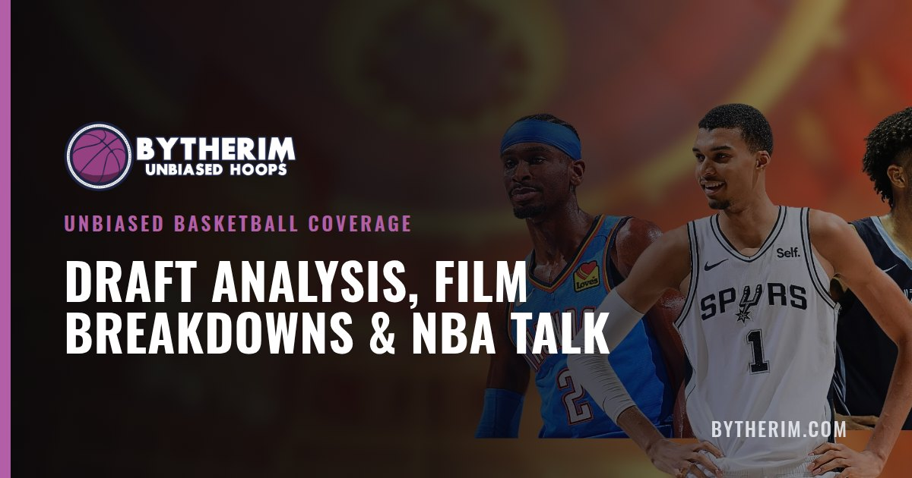
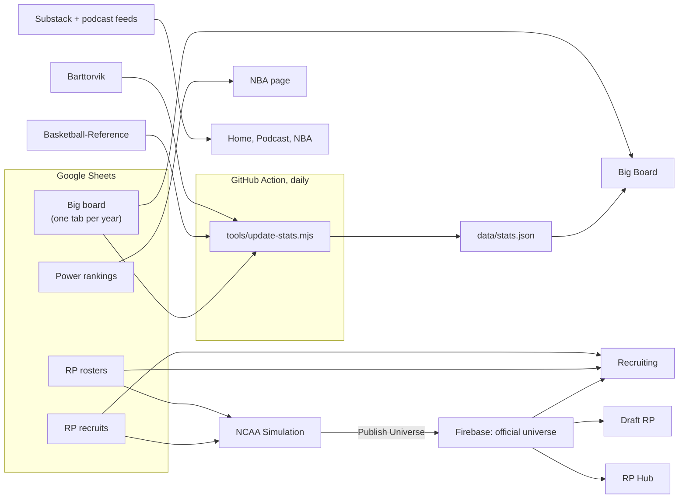

# BYTHERIM



**[bytherim.com](https://bytherim.com)** — unbiased basketball coverage: an NBA draft big board, film breakdowns, the podcast, and **BYTHERIM RP**, a full college basketball universe with its own recruiting, season simulation and NBA draft.

The whole site is plain HTML, CSS and JavaScript served by GitHub Pages. There's no build step and no server of our own: content comes from Google Sheets and public feeds, and Firebase (Google sign-in plus a small database) holds accounts, saves and what admins publish.

## The site

| Page | What it is |
|---|---|
| [Home](https://bytherim.com/) | Latest writing and episodes, the big board top 10, YouTube, TikTok and Instagram |
| [Big Board](https://bytherim.com/draft.html) | Every prospect in the NBA draft by tier, with scouting reports, measurements and stats — plus past boards and where those players were actually drafted |
| [Podcast](https://bytherim.com/podcast.html) · [NBA](https://bytherim.com/nba.html) · [About](https://bytherim.com/about.html) | Episodes, NBA essays and power rankings, and what BYTHERIM is |
| [RP Hub](https://bytherim.com/rp/) · [How it works](https://bytherim.com/rp/guide.html) | The front door to the RP universe |
| [Recruiting](https://bytherim.com/recruiting/) | Class and school rankings, prospect profiles, commitments and the transfer portal |
| [NCAA Simulation](https://bytherim.com/rp/ncaa.html) | Every Division I program, simulated week by week, with a draft every offseason |
| [Draft RP](https://bytherim.com/rp/draft.html) | The RP's NBA draft: an in-season big board and mock draft, the declared class, and draft night |

## How it fits together



- **The big board** is a Google Sheet published to the web. Each tab named like `2026 Board` becomes a past board on the site automatically.
- **College and pro stats** are pulled every morning by a GitHub Action ([`update-stats.yml`](.github/workflows/update-stats.yml)) from Barttorvik and, for players with a Basketball-Reference link, Basketball-Reference. It respects both sites' crawl delays, and a failed download never erases numbers that are already saved.
- **The RP universe** runs in the browser. Each save lives in the visitor's browser and, when they sign in with Google, autosaves to their account. The official season is run by BYTHERIM and published with **Publish Universe** in the sim's menu (admins only), which updates the Draft RP, the recruiting portal and the RP Hub for everyone. `data/universe.json` is only the fallback if nothing has been published.
- **Generated recruits** fill every class out to a top 250 around the recruiting sheet ([`rp/js/recruit-gen.js`](rp/js/recruit-gen.js)): bios, offers, final lists, commitments and stats, the same on every page. Sheet players keep their order and always win; a generated player can be made permanent by copying his row from the recruiting admin into the sheet. Each class's #1 on the sheet is always #1, and the ranking follows the ratings: generated players fall where their rating puts them, never ahead of a higher-rated sheet player.
- **Live recruiting** ([`rp/js/recruit-live.js`](rp/js/recruit-live.js)): in the NCAA RP, the two classes in high school are recruited as the seasons play. Lists shrink from a dozen schools to a top 8, a top 5 and a final 3; programs pull by prestige, how they're trending, last March and the coach; teammates from the same high school or AAU team draw each other; and a coaching change can reopen a commitment. Commitments on the sheet never move. The published universe carries this to the recruiting page, where classes the sim hasn't reached are shown uncommitted.
- **Lineups**: each team starts its best five, not one player per position: two point guards or two power forwards can start together, as long as the lineup keeps two or three guards and at least one big. A player listed at two positions on either sheet ("PF/C", "SF/PF") is shown and sorted at the first everywhere; the second is only for lineups, letting him cover a spot the best five would otherwise leave short (a 7'2" PF as the big, an SF/SG as the second guard). Box scores mark the starters. A top recruit gets an early-season leash (an early slump doesn't cost him), then form decides; a blue-chip freshman who loses his starting job often enters the portal.
- **Overseas prospects**: an academy (the NBA Academies, INSEP, SEED, a club's youth team) is high school, not a pro club. Overseas prospects are recruited by colleges like anyone else; those who don't come over sign with a club: Europeans in the European leagues, Australians in the NBL, Africans mostly in Europe and sometimes the BAL.
- **Team pages and search**: the Teams index, Team Stats and Player Stats each have a search box (a player search finds anyone, with his place on the board), and every team page has a team finder. Each finished season is kept whole (coach, team stats with national ranks, every player's line), so a past team opens like a current one, from **Team History** or from the school in a player's season row.
- **International prospects on the draft board**: pros are scored for projected upside (their recruiting rating, youth and how scouts see them that year), some have breakout seasons, and a thin domestic class leans on them harder.
- **Summer circuit** ([`rp/js/summer-core.js`](rp/js/summer-core.js)): a short season of its own, played on the **Recruiting page** against the NCAA RP save in the same browser (the way the draft is played in the Draft RP). After the transfer portal the NCAA RP plans the summer and waits at its Summer Circuit step; the Recruiting page's Summer Circuit tab has the Sim buttons, a step at a time: four AAU sessions on three circuits (Nike EYBL, Adidas 3SSB, Under Armour Association), the championships (Peach Jam, the 3SSB Championship, the UAA Finals), then the FIBA U17 (even summers) or U19 (odd) World Cup's groups, knockouts and medal games. (It can be played from the NCAA RP's Summer Circuit page instead.) A new save starts with the summer before its first season already played. An AAU program is one program however it's written ("Team Takeover EYBL" or "Team Takeover"), and the sheet's real programs play on their own circuit. Each player's summer is modeled on his written AAU/FIBA line (per-minute production and shooting, shared out on his team; AAU games are 32 minutes), and the simulated line replaces the written one on his profile. The tab shows the whole season: standings, every result and box score, brackets, rosters, leaders, and each player's game log; without a save it shows the published universe's summer.
- **Recruit stats drive college play**: a player's two-point and free-throw percentage, three-point rate and accuracy, and assist rate come from his high-school, AAU and FIBA numbers on the recruiting sheet (weighted by games and level). Saves re-read the sheet when they open, so fixes to the sheet reach saves already in progress.
- **Resetting generated players**: the recruiting admin can give a class (or every class not yet being recruited) brand-new generated players. Generated players are never rated above 95.
- **Admin pages** (admins only, linked from the account menu): [`admin.html`](admin.html) edits the home page hero slides and pinned X / Instagram posts; [`rp/admin.html`](rp/admin.html) shows every team, player overall and coach in the RP save; [`recruiting/admin.html`](recruiting/admin.html) shows each class's sheet and generated prospects. The admin list and database rules are in [`firestore.rules`](firestore.rules), which is pasted into the Firebase console.
- **The draft happens in the Draft RP.** When a season ends, the NCAA RP waits at its *NBA Draft* step while the Draft RP runs the combine, lottery, team workouts, withdrawal deadline and draft night against the same save (the shared logic is [`rp/js/draft-cycle.js`](rp/js/draft-cycle.js)). Combine testing is built from each player's measurements, the sheet's Attributes and Athleticism columns, and the recruiting database's scouting report; workouts depend on each NBA team's workout style and the prospect's personality.
- **Scripted storylines** come straight from the roster sheet: a player listed at a new school in the next season's rows transfers there, and a Draft value like `2029 R:1 P:5` makes him the fifth pick of the 2029 draft.

## What's where

```
index.html, draft.html, podcast.html, nba.html, about.html   main site
404.html                    "Air ball" page for broken links
assets/                     shared design (site.css, site.js), big board code (board.js),
                            RP header/footer (chrome.css), share images, icons
data/stats.json             college + pro stats for the big board (written by the daily job)
admin.html                  site admin: home page hero slides and pinned posts
rp/                         RP Hub, guide, NCAA Simulation (ncaa.html + js/), Draft RP, RP admin
rp/js/cloud.js              accounts, saves and publishing (Firebase); config in cloud-config.js
firestore.rules             database rules, pasted into the Firebase console
recruiting/                 recruiting rankings, profiles and the transfer portal
2028/ … 2040/               recruit photos, by class (file names must match the recruiting sheet's Avatar column exactly)
schoollogos/ nbalogos/ conferencelogos/                     logos
tools/update-stats.mjs      the daily stats job
tools/page-meta.py          writes share-preview and icon tags into every page
rp/tests/                   automated checks (see rp/tests/readme)
ncaa/                       redirect from the sim's old address
CNAME, sitemap.xml, robots.txt, site.webmanifest            domain, search and "Add to Home Screen"
```

## Working on it

- **Content** changes happen in the Google Sheets; the site picks them up on the next page load.
- **Site settings** such as social links, the support link and visitor counting (GoatCounter) are in `CONFIG` at the top of [`assets/site.js`](assets/site.js).
- **NCAA RP title art**: put an image in `rp/art/` and add `style="--home-art: url('art/your-image.jpg')"` to the `.home-art` element in [`rp/ncaa.html`](rp/ncaa.html). The court lines and colour wash stay on top so the title stays readable.
- **Stats** refresh daily. To run the job now: Actions → *Update big board stats* → *Run workflow*.
- **Tests** cover the main site, the simulation, the Draft RP, recruiting and the stats job:

  ```
  npm install jsdom papaparse
  cd rp && node tests/run-all.js
  ```

## Credits

College stats from [Barttorvik](https://barttorvik.com). International and G League stats from [Basketball-Reference](https://www.basketball-reference.com).
